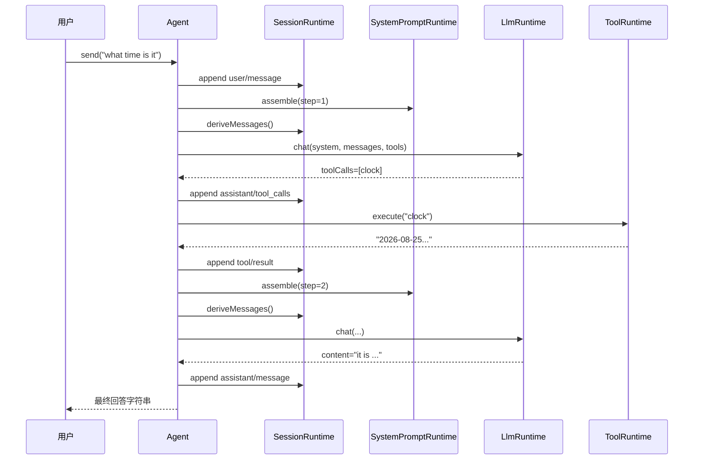
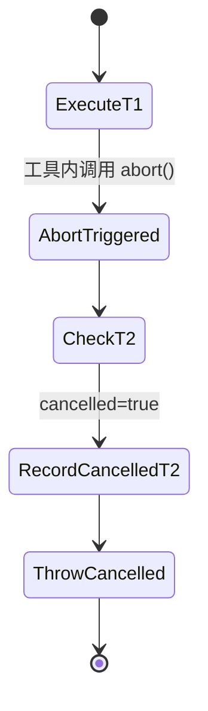

# Agent Loop 深度讲解
> 源码基准：`2fbb62996bbf16d556a627ad5646af2ffa6c415b`
> 生成日期：2026-09-03
> 目标读者：小白 / 后端开发者 / 熟练开发者三档共读
本文讲解 mini-dsh 项目第 4 天新增的 Agent Runtime、Agent Loop Runtime、两个 Cordis 插件，以及 `core.test.ts` 中新增的四个回归测试。源码链接中的行号都基于上面的 Git commit。如果后续代码发生变化，请优先使用“文件名 + 类型名或方法名”重新定位。
---
## 0. 阅读路线
| 读者 | 建议读法 | 重点 |
| --- | --- | --- |
| 🐤 小白 | 从第 1 节顺序读到最后 | 先建立类比，再跟着 `agent.send()` 走完整流程 |
| 🦾 后端开发者 | 重点读第 2、6、7、10 节 | 依赖关系、主循环、取消一致性、设计边界 |
| ⚡ 熟练开发者 | 先看全景图，再读第 7、10、12 节 | 多工具取消、事件日志、面试问答 |
第一次阅读时，你只需要先记住两个名字：
- **Agent**：保存“我是谁、使用哪个会话、使用哪个模型”。
- **Agent Loop**：真正反复调用模型和工具，直到拿到最终回答。
不要一开始就试图记住全部类型。 后面我们会从一次 `agent.send()` 出发，把每个对象放回它出现的位置。
---
## 1. 类比开场：把 Agent 系统想成一家任务处理中心
想象你去一家任务处理中心，提交一句话：
> “帮我查一下现在几点。”
中心里有几种角色：
1. **员工 Agent** 带着自己的工牌、工作档案和指定沟通渠道。
2. **员工登记处 AgentRuntime** 负责创建员工、登记员工和列出员工。
3. **调度流程 AgentLoopRuntime** 决定员工下一步该问模型还是调用工具。
4. **档案室 SessionRuntime** 记录用户消息、模型决定和工具结果。
5. **工作守则 SystemPromptRuntime** 每一步重新生成当前规则。
6. **工具间 ToolRuntime** 保存时钟、搜索等可执行工具。
7. **模型前台 LlmRuntime** 根据 `provider/model` 找到正确的大模型。
员工 Agent 自己不跑来跑去。 当你调用 `agent.send('现在几点')` 时，Agent 只是把任务交给调度流程：
真正决定“问模型 → 调工具 → 再问模型”的，是 Agent Loop。 这就是本次设计最重要的分工：
> **Agent 是身份和入口，Agent Loop 是行为和流程。**
> 📦 **额外知识：什么是 Runtime？**
>
> Runtime 可以理解为“程序运行期间负责管理某类能力的对象”。
> `AgentRuntime` 管理 Agent，`ToolRuntime` 管理工具，
> `LlmRuntime` 管理模型供应商。它们不是操作系统级运行时，
> 而是这个项目给核心管理类使用的统一命名。
---
## 2. 全景图：新增代码放在项目什么位置
### 2.1 四个新增文件的职责
| 文件 | 类比 | 核心职责 | 源码 |
| --- | --- | --- | --- |
| `agent-runtime.ts` | 员工登记处 | 创建、注册、列出 Agent | [agent-runtime.ts](file:///Users/yuka/mini-dsh-learn/src/core/agent-runtime.ts#L1-L114) |
| `agent-loop-runtime.ts` | 调度中心 | 驱动模型和工具循环 | [agent-loop-runtime.ts](file:///Users/yuka/mini-dsh-learn/src/core/agent-loop-runtime.ts#L1-L230) |
| `agents.ts` | Cordis 服务窗口 | 把 AgentRuntime 暴露成 `ctx.agents` | [agents.ts](file:///Users/yuka/mini-dsh-learn/src/plugins/agents.ts#L1-L41) |
| `agent-loop.ts` | Cordis 调度窗口 | 注入四个依赖，暴露 `ctx.agentLoop` | [agent-loop.ts](file:///Users/yuka/mini-dsh-learn/src/plugins/agent-loop.ts#L1-L52) |
### 2.2 依赖关系
一个关键事实是：**AgentLoopRuntime 不在内部创建其他 Runtime。** 它接收外部传入的 Session、System Prompt、Tool 和 LLM 四个依赖。
这种做法让 Agent Loop 可以在测试中连接 mock， 在真实程序中再连接真正的 Session、工具和模型实现。
### 2.3 一次请求的时序图

图里的 `A` 虽然写着 Agent，实际循环代码运行在 AgentLoopRuntime 中。 Agent 只是通过 `send()` 把自己和输入一起传给 Loop。
命名提示：模型内部响应使用 `toolCalls`；`assistant/tool_calls` 是 Session 事件名；投影给模型 API 的消息字段才是 `tool_calls`。
> 📦 **额外知识：什么是依赖注入？**
>
> 依赖注入就是“需要什么，由外部传进来”，而不是在类内部自己 `new`。
> AgentLoopRuntime 不自己创建 Session、Prompt、Tool、LLM，
> 所以测试能传入可控对象，插件层也能传入 Cordis 上的共享服务。
---
## 3. 先认识五个会反复出现的概念
### 3.1 Agent
Agent 是一个普通对象，形状可以先记成 `{ id, name, sessionId, model, send() }`，它回答四个问题：
- 我是谁：`id`
- 我叫什么：`name`
- 我的对话记录在哪里：`sessionId`
- 我使用哪个模型：`model`
### 3.2 Agent Loop
Agent Loop 是一个重复流程：`问模型 → 有 toolCalls 就执行工具并记录结果 → 再问模型 → 没有 toolCalls 就返回答案`。
循环的停止条件不是固定次数，而是模型返回的 `toolCalls` 为空。
### 3.3 tool call 和 tool result
模型返回 `{ id: 't1', name: 'clock', arguments: {} }`，代表一次 tool call。
执行后必须写入 `{ toolCallId: 't1', content: '10:00' }`，代表对应的 tool result。
两边通过 `t1` 配对。如果只有 tool call，没有 tool result，下一次模型请求的历史消息可能被拒绝。
### 3.4 流式回调
模型可能不是一次性返回完整文本，而是一小段一小段返回：
`onContent` 和 `onReasoning` 就是把这些小片段及时交给 UI 或 CLI。 Agent Loop 不修改片段，只负责透传。
### 3.5 disposer
注册 Agent 后返回一个函数：`const dispose = runtime.register(agent); dispose();`
这个函数负责撤销刚才的注册。 它通常用于插件卸载、测试清理和资源释放。
> 📦 **额外知识：为什么注册方法返回函数？**
>
> 因为调用者最清楚什么时候不再需要这次注册。
> 返回 disposer 后，注册和清理天然成对，
> 不需要调用者再记住复杂的删除参数。
---
## 4. `agent-runtime.ts` 逐行讲解
完整文件见 [agent-runtime.ts](file:///Users/yuka/mini-dsh-learn/src/core/agent-runtime.ts#L1-L114)。
### 4.1 第 3 行：只导入类型
源码：[agent-runtime.ts](file:///Users/yuka/mini-dsh-learn/src/core/agent-runtime.ts#L3-L3)
```ts
import type { AgentLoop, AgentRunOptions } from './agent-loop-runtime.js';
```
逐项解释：
- `import`：从另一个模块引入名字。
- `type`：告诉 TypeScript，这些名字只用于类型检查。
- `AgentLoop`：Agent 需要的最小循环接口。
- `AgentRunOptions`：调用 `send()` 时可传入的取消信号和回调。
- `.js` 后缀：项目使用 NodeNext 模块规则，源码虽然是 `.ts`，运行时导入路径写 `.js`。
使用 `import type` 后，编译出的 JavaScript 不需要真的加载这两个类型。 这也减轻了 `agent-runtime.ts` 与 `agent-loop-runtime.ts` 互相引用时的运行时循环依赖。
### 4.2 第 11-17 行：定义 Agent 的形状
源码：[agent-runtime.ts](file:///Users/yuka/mini-dsh-learn/src/core/agent-runtime.ts#L11-L17)
```ts
export interface Agent {
  id: string;
  name: string;
  sessionId: string;
  model: string;
  send(input: string, options?: AgentRunOptions): Promise<string>;
}
```
逐行解释：
- `export interface Agent`：导出一个名为 Agent 的类型约束。
- `id: string`：程序内部使用的唯一身份。
- `name: string`：给人看的名称，默认是 `default`。
- `sessionId: string`：指向 SessionRuntime 中的某个会话。
- `model: string`：模型选择值，格式为 `provider/model`。
- `send(...)`：对外唯一的主要行为。
- `input: string`：用户输入。
- `options?`：问号表示可不传。
- `Promise<string>`：异步完成后返回最终回答字符串。
这里故意没有：
- `while` 循环
- `tools.execute()`
- `llm.chat()`
- `sessions.append()`
因为 Agent 只是句柄，不应该承担流程编排。
### 4.3 第 22-27 行：创建 Agent 的参数
源码：[agent-runtime.ts](file:///Users/yuka/mini-dsh-learn/src/core/agent-runtime.ts#L22-L27)
```ts
export interface CreateAgentOptions {
  sessionId: string;
  model: string;
  loop: AgentLoop;
  name?: string;
}
```
这和 Agent 接口很像，但有两个明显区别：
1. 不需要传 `id`，因为 Runtime 会生成。
2. 不需要传 `send`，因为 Runtime 会自动创建。
`loop: AgentLoop` 是最重要的一行。 它意味着每个 Agent 都明确知道自己把任务委托给哪一个 Loop。
### 4.4 第 39-41 行：Agent 注册表
源码：[agent-runtime.ts](file:///Users/yuka/mini-dsh-learn/src/core/agent-runtime.ts#L39-L41)
```ts
export class AgentRuntime {
  private agents = new Map<string, Agent>();
```
逐行解释：
- `class AgentRuntime`：定义运行期间的 Agent 管理器。
- `private`：外部不能直接修改注册表。
- `Map<string, Agent>`：键是字符串 ID，值是 Agent。
- `new Map()`：一开始是空表。
使用 Map 后，可以快速按 ID 判断是否已注册、读取或删除对象；`list()` 再把全部值转成数组。
当前学习版只存在内存中，程序退出后数据不会保留。
### 4.5 第 48-59 行：注册前校验
源码：[agent-runtime.ts](file:///Users/yuka/mini-dsh-learn/src/core/agent-runtime.ts#L48-L59)
```ts
register(agent: Agent): () => void {
  if (!agent || !agent.id) {
    throw new Error('agent.id is required');
  }
  if (typeof agent.send !== 'function') {
    throw new Error(`agent.send must be a function for "${agent.id}"`);
  }
  if (this.agents.has(agent.id)) {
    throw new Error(`agent "${agent.id}" already registered`);
  }

  this.agents.set(agent.id, agent);
```
第一行的返回类型 `() => void` 表示：`register()` 返回另一个没有参数、没有返回值的函数。
三个检查分别防止：
1. Agent 没有 ID。
2. Agent 没有可调用的 `send()`。
3. 相同 ID 被重复注册。
通过校验后才执行 `set()`。 这种“尽早失败”比等到后面调用 Agent 时再报错更容易定位问题。
### 4.6 第 61-71 行：disposer 为什么能安全重复调用
源码：[agent-runtime.ts](file:///Users/yuka/mini-dsh-learn/src/core/agent-runtime.ts#L61-L71)
```ts
let disposed = false;
return () => {
  if (disposed) return;

  if (this.agents.get(agent.id) === agent) {
    this.agents.delete(agent.id);
  }
  disposed = true;
};
```
逐行解释：
- `let disposed = false`：记录是否已经清理。
- `return () => {}`：返回真正的清理函数。
- `if (disposed) return`：第二次调用直接结束。
- `get(agent.id) === agent`：不仅比较 ID，还比较对象引用。
- `delete(agent.id)`：确认还是原对象后才删除。
- `disposed = true`：以后不能再次产生副作用。
为什么要比较对象引用？ 假设将来允许同一个 ID 重新注册新 Agent。 旧 disposer 如果只根据 ID 删除，就可能误删新 Agent。 引用比较让旧 disposer 只能删除自己当初登记的对象。
> 📦 **额外知识：这里使用了闭包**
>
> disposer 函数离开 `register()` 后，仍然能访问 `disposed` 和 `agent`。
> 这种“函数记住创建时作用域变量”的能力叫闭包。
> `create()` 中的 `send()` 也使用了同样机制。
### 4.7 第 77-86 行：创建参数校验
源码：[agent-runtime.ts](file:///Users/yuka/mini-dsh-learn/src/core/agent-runtime.ts#L77-L86)
```ts
create(options: CreateAgentOptions): Agent {
  if (!options?.sessionId) {
    throw new Error('sessionId is required');
  }
  if (!options.model) {
    throw new Error('model is required');
  }
  if (!options.loop || typeof options.loop.run !== 'function') {
    throw new Error('loop must have a run method');
  }
```
这里要求三个核心信息必须存在：
- Session：保存对话历史。
- Model：决定请求发给哪个模型。
- Loop：负责真正运行任务。
`options?.sessionId` 使用可选链。 即使调用者错误地传入 `undefined`，检查本身也不会先抛出属性访问异常。
### 4.8 第 88-101 行：创建 Agent 和最关键的 send 闭包
源码：[agent-runtime.ts](file:///Users/yuka/mini-dsh-learn/src/core/agent-runtime.ts#L88-L101)
```ts
const id = globalThis.crypto.randomUUID();
const loop = options.loop;

const agent: Agent = {
  id,
  name: options.name ?? 'default',
  sessionId: options.sessionId,
  model: options.model,
  send: (input, runOptions) => loop.run(agent, input, runOptions),
};
```
逐行解释：
- `randomUUID()`：生成唯一 Agent ID。
- `const loop = options.loop`：把 Loop 保存到局部变量。
- `const agent: Agent`：创建符合 Agent 接口的对象。
- `name ?? 'default'`：只有 `name` 是 `null` 或 `undefined` 时使用默认值。
- `sessionId`：把 Agent 和已有 Session 绑定。
- `model`：保存完整的模型选择值。
- `send`：把当前 Agent、输入和运行选项交给 Loop。
最容易疑惑的是：右侧函数中为什么可以引用正在创建的 `agent`？因为正确写法保存的是函数：`send: input => loop.run(agent, input)`，不会立刻执行。
等用户以后调用 `send()` 时，`agent` 早已完成赋值；若误写成 `send: loop.run(agent, input)`，创建对象时就会立即执行。
### 4.9 第 103-113 行：创建后注册并提供列表
源码：[agent-runtime.ts](file:///Users/yuka/mini-dsh-learn/src/core/agent-runtime.ts#L103-L113)
```ts
this.register(agent);
return agent;
```
`create()` 不只是构造对象，还会立即登记对象，所以 `const agent = runtime.create(options); runtime.list()` 会直接包含这个 `agent`。
`list()` 返回 `Array.from(this.agents.values())`：`Map.values()` 产生迭代器，`Array.from()` 再把它转换成普通数组。
---
## 5. `agent-loop-runtime.ts` 类型部分逐行讲解
完整文件见 [agent-loop-runtime.ts](file:///Users/yuka/mini-dsh-learn/src/core/agent-loop-runtime.ts#L1-L230)。
### 5.1 第 3-10 行：全部是类型依赖
源码：[agent-loop-runtime.ts](file:///Users/yuka/mini-dsh-learn/src/core/agent-loop-runtime.ts#L3-L10) 这些导入说明 Agent Loop 要和哪些模块合作：
- `Agent`：谁正在运行。
- `ChatRequest`、`ChatResponse`：模型请求和响应。
- `LlmRuntime`：调用哪个模型。
- `SystemPromptRuntime`：生成本轮系统提示词。
- `SessionRuntime`：读写事件日志。
- `ExecutionResult`、`ToolRuntime`：执行工具并处理结果。
它们全部使用 `import type`，因为这里主要需要 TypeScript 类型约束。 真正的对象由构造函数参数传进来。
### 5.2 第 15-21 行：运行选项和四种回调
源码：[agent-loop-runtime.ts](file:///Users/yuka/mini-dsh-learn/src/core/agent-loop-runtime.ts#L15-L21)
```ts
export interface AgentRunOptions {
  signal?: AbortSignal;
  onReasoning?: (chunk: string) => void;
  onContent?: (chunk: string) => void;
  onToolCall?: (call: AgentToolCall) => void;
  onToolResult?: (result: AgentToolResult) => void;
}
```
逐行解释：
- `signal`：一个只读的 `AbortSignal`；外部通过 `AbortController.abort()` 把它切换为已取消状态。
- `onReasoning`：模型每产生一段推理内容就调用。
- `onContent`：模型每产生一段最终文本就调用。
- `onToolCall`：工具真正执行前调用。
- `onToolResult`：工具执行并渲染完成后调用。
所有字段都有 `?`，所以最简单的调用仍然是 `await agent.send('hello')`；需要流式显示时才传回调。
### 5.3 第 26-30 行：AgentToolCall
源码：[agent-loop-runtime.ts](file:///Users/yuka/mini-dsh-learn/src/core/agent-loop-runtime.ts#L26-L30)
```ts
export interface AgentToolCall {
  id: string;
  name: string;
  arguments: any;
}
```
- `id`：这次调用的唯一编号。
- `name`：调用哪个工具。
- `arguments`：传给工具的参数。
例如：`{ id: 'tc1', name: 'search', arguments: { q: 'foo' } }`。
### 5.4 第 38-42 行：交叉类型 AgentToolResult
源码：[agent-loop-runtime.ts](file:///Users/yuka/mini-dsh-learn/src/core/agent-loop-runtime.ts#L38-L42)
```ts
export type AgentToolResult = ExecutionResult & {
  name: string;
  toolCallId: string;
  renderedContent: string;
};
```
`&` 表示交叉类型，也就是“同时拥有两边的字段”。`ExecutionResult` 已有 `value`、`content`、`isError`；
`AgentToolResult` 又补充 `name`、`toolCallId`、`renderedContent`。
这样 `onToolResult` 的接收者既能看到原始结果，也能知道它属于哪个工具调用。
### 5.5 第 50-55 行：四个构造函数依赖
源码：[agent-loop-runtime.ts](file:///Users/yuka/mini-dsh-learn/src/core/agent-loop-runtime.ts#L50-L55)
```ts
export interface AgentLoopDependencies {
  sessions: SessionRuntime;
  systemPrompt: SystemPromptRuntime;
  tools: ToolRuntime;
  llm: LlmRuntime;
}
```
四个依赖分别回答：
| 依赖 | Agent Loop 问它什么 |
| --- | --- |
| `sessions` | 历史记录是什么？把新事件记下来 |
| `systemPrompt` | 这一轮的系统提示词是什么？ |
| `tools` | 有哪些工具？执行指定工具 |
| `llm` | 把请求发给指定模型 |
### 5.6 第 62-64 行：最小 AgentLoop 接口
源码：[agent-loop-runtime.ts](file:///Users/yuka/mini-dsh-learn/src/core/agent-loop-runtime.ts#L62-L64)
```ts
export interface AgentLoop {
  run(agent: Agent, input: string, options?: AgentRunOptions): Promise<string>;
}
```
AgentRuntime 不要求传入的一定是 `AgentLoopRuntime` 类实例。 它只要求对象具有兼容的 `run()`。 这叫“面向接口编程”：
- 生产环境可以传真实 AgentLoopRuntime。
- 测试可以传一个只有 `run()` 的简单假对象。
- 以后可以实现另一个 Loop，而不修改 AgentRuntime。
### 5.7 第 73-74 行：取消结果常量
源码：[agent-loop-runtime.ts](file:///Users/yuka/mini-dsh-learn/src/core/agent-loop-runtime.ts#L73-L74)
```ts
export const CANCELLED_RESULT =
  'ToolError: the run was cancelled before this tool ran';
```
它不是抛出的异常文本，而是写入 Session 的工具结果。 用途是告诉模型：
> “这个工具调用有对应结果，但结果是未执行，因为任务已取消。”
后面第 7 节会详细解释为什么这是整个取消机制最关键的补偿数据。
### 5.8 第 88-99 行：构造函数只保存依赖
源码：[agent-loop-runtime.ts](file:///Users/yuka/mini-dsh-learn/src/core/agent-loop-runtime.ts#L88-L99)
```ts
constructor(dependencies: AgentLoopDependencies) {
  this.sessions = dependencies.sessions;
  this.systemPrompt = dependencies.systemPrompt;
  this.tools = dependencies.tools;
  this.llm = dependencies.llm;
}
```
这里没有 `new SessionRuntime()` 等代码。构造函数只把外部对象保存到私有只读字段中，后面的 `run()` 再反复使用它们。
---
## 6. `run()` 主循环逐步讲解
`run()` 是整个项目目前最接近“心脏”的方法。 源码范围见 [agent-loop-runtime.ts](file:///Users/yuka/mini-dsh-learn/src/core/agent-loop-runtime.ts#L104-L229)。
### Step 1：接收 Agent、用户输入和运行选项
源码：[agent-loop-runtime.ts](file:///Users/yuka/mini-dsh-learn/src/core/agent-loop-runtime.ts#L104-L115)
```ts
async run(
  agent: Agent,
  input: string,
  {
    signal,
    onReasoning,
    onContent,
    onToolCall,
    onToolResult,
  }: AgentRunOptions = {}
): Promise<string> {
  const sessionId = agent.sessionId;
```
**这一步在干嘛：** 从 Agent 中取出会话 ID，并把可选配置解构出来。**为什么给解构参数默认 `{}`：** 用户只写 `await agent.send('hello')` 时，第三个参数就是 `undefined`；默认 `{}` 后，解构不会报错，各个回调自然都是 `undefined`。
### Step 2：先记录用户消息
源码：[agent-loop-runtime.ts](file:///Users/yuka/mini-dsh-learn/src/core/agent-loop-runtime.ts#L117-L120)
```ts
this.sessions.append(sessionId, 'user/message', { content: input });
let step = 0;
```
**这一步在干嘛：** 把用户输入写进事件日志，然后初始化循环步数。 为什么必须先写日志？ 因为下一步 `deriveMessages()` 会从 Session 中生成模型请求。 如果没有写入用户消息，模型根本看不到本次问题。
### Step 3：进入没有固定上限的循环
源码：[agent-loop-runtime.ts](file:///Users/yuka/mini-dsh-learn/src/core/agent-loop-runtime.ts#L122-L130)
```ts
while (true) {
  step += 1;

  if (signal?.aborted) {
    throw new Error('Agent run cancelled');
  }
```
**这一步在干嘛：** 每一轮先增加步数，再检查任务是否已经取消。 `signal?.aborted` 的含义：
- 没传 `signal`：结果是 `undefined`，不会取消。
- 传了但未取消：结果是 `false`。
- 已调用 `abort()`：结果是 `true`，立即抛错。
这里可以立即抛错，因为本轮还没有写入新的 assistant tool call， 不会留下“有调用、无结果”的半截历史。
### Step 4：每轮重新组装 system prompt
源码：[agent-loop-runtime.ts](file:///Users/yuka/mini-dsh-learn/src/core/agent-loop-runtime.ts#L132-L138)
```ts
const system = await this.systemPrompt.assemble({
  agent,
  sessionId,
  step,
});
```
**这一步在干嘛：** 把 Agent、会话 ID 和当前步数交给 SystemPromptRuntime。 **为什么不是循环外只组装一次：** system prompt 可能包含动态信息，例如：
- 当前时间
- 当前工作目录
- 本轮步数
- 会话状态
- 工具或权限变化
工具执行后，这些信息可能已经改变。 每轮重建才能保证模型看到当前状态。
### Step 5：从事件日志投影 messages
源码：[agent-loop-runtime.ts](file:///Users/yuka/mini-dsh-learn/src/core/agent-loop-runtime.ts#L140-L141)
```ts
const messages = this.sessions.deriveMessages(sessionId);
```
**这一步在干嘛：** 让 SessionRuntime 把内部事件转换成模型 API 需要的消息。 Agent Loop 不维护第二份 `messages` 数组。 Session 事件日志才是单一事实来源：
这样做可以避免“日志是一份、模型历史又是另一份”，最后两者不同步。
> 📦 **额外知识：什么是单一事实来源？**
>
> Single Source of Truth 指系统只认一份权威数据。
> 本项目把 SessionEvent（泛指 Session 日志中的一条事件）作为权威数据，messages 每次临时投影生成。
> 如果同时手动维护 events 和 messages，两份数据很容易出现一边更新、另一边漏更新。
### Step 6：构造模型请求
源码：[agent-loop-runtime.ts](file:///Users/yuka/mini-dsh-learn/src/core/agent-loop-runtime.ts#L143-L152)
```ts
const request: ChatRequest = {
  system,
  messages,
  tools: this.tools.schemas(),
  signal,
  onReasoning,
  onContent,
};
const response: ChatResponse = await this.llm.chat(request, agent.model);
```
字段解释：
- `system`：本轮新组装的系统提示词。
- `messages`：本轮从事件日志投影出的完整历史。
- `tools`：ToolRuntime 生成的工具说明书。
- `signal`：让模型适配器也有机会响应取消。
- `onReasoning`：推理流回调。
- `onContent`：回答文本流回调。
- `agent.model`：告诉 LlmRuntime 使用哪个 `provider/model`。
注意：工具执行回调没有传给 LLM， 因为真正执行工具的是 Agent Loop，不是模型适配器。
### Step 7：统一处理没有 toolCalls 的情况
源码：[agent-loop-runtime.ts](file:///Users/yuka/mini-dsh-learn/src/core/agent-loop-runtime.ts#L154-L161)
```ts
const toolCalls = (response.toolCalls ?? []) as AgentToolCall[];

if (toolCalls.length === 0) {
  const content = response.content ?? '';
  this.sessions.append(sessionId, 'assistant/message', { content });
  return content;
}
```
`response.toolCalls ?? []` 把两种情况统一成空数组：
- 模型没有返回 `toolCalls`
- 模型明确返回 `toolCalls: []`
数组为空说明模型已经给出最终答案：
1. `content ?? ''` 保证得到字符串。
2. 写入 `assistant/message`。
3. `return content` 结束整个 `while (true)`。
所以 Agent Loop 的正常停止条件是：
> **本轮模型响应不包含任何工具调用。**
### Step 8：有工具调用时，先记录模型决定
源码：[agent-loop-runtime.ts](file:///Users/yuka/mini-dsh-learn/src/core/agent-loop-runtime.ts#L163-L169)
```ts
this.sessions.append(sessionId, 'assistant/tool_calls', {
  content: response.content ?? null,
  reasoningContent: response.reasoningContent,
  toolCalls,
});
```
为什么先记日志再执行工具？ 因为工具结果必须有一个已经存在的 assistant tool call 作为前因。 这里同时保存：
- 模型可能附带的普通文字
- 模型推理内容
- 完整工具调用列表
尤其不能丢掉 `reasoningContent`。 SessionRuntime 会把它投影成 `reasoning_content`，供下一轮模型请求使用。
### Step 9：逐个执行同一轮中的所有工具
源码：[agent-loop-runtime.ts](file:///Users/yuka/mini-dsh-learn/src/core/agent-loop-runtime.ts#L171-L201)
```ts
let cancelled = false;

for (const call of toolCalls) {
  cancelled ||= Boolean(signal?.aborted);

  if (cancelled) {
    // 写取消结果
    continue;
  }

  onToolCall?.(call);
  const result = await this.tools.execute(call.name, call.arguments, {
    signal,
    sessionId,
    toolCallId: call.id,
    agent,
  });
```
关键点有三个：
1. 使用 `for...of` 按顺序处理。
2. 每次循环都重新读取 `signal.aborted`。
3. 把 Agent、Session 和 toolCallId 一起传给工具。
工具可能需要知道：
- 自己属于哪个会话
- 自己对应哪次模型调用
- 当前 Agent 是谁
- 用户是否要求取消
### Step 10：把工具结果转换并广播
源码：[agent-loop-runtime.ts](file:///Users/yuka/mini-dsh-learn/src/core/agent-loop-runtime.ts#L203-L221)
```ts
const renderedContent = this.tools.renderResult(result);
const toolResult: AgentToolResult = {
  ...result,
  renderedContent,
  name: call.name,
  toolCallId: call.id,
};

onToolResult?.(toolResult);

this.sessions.append(sessionId, 'tool/result', {
  toolCallId: call.id,
  name: call.name,
  isError: result.isError,
  content: renderedContent,
});
```
**为什么既保留 `result`，又生成 `renderedContent`：**
- `result.value` 方便程序使用原始值。
- `result.content` 是内容块数组。
- `renderedContent` 是可以写进 Session、发回模型的字符串。
`...result` 是对象展开语法，把原结果字段复制到新对象。 然后再增加工具名、调用 ID 和渲染文本。
### Step 11：回到循环顶部
如果工具全部执行完，而且没有取消：
模型下一轮能看到刚写入的 tool result， 于是可以根据工具结果生成最终答案，或者继续要求调用其他工具。
---
## 7. 最容易踩坑的地方：多工具调用中的取消
### 7.1 问题场景
假设模型一次返回两个调用：
`toolCalls = [{ id: 't1' }, { id: 't2' }]`。
执行 `t1` 时，用户触发取消。错误写法是在处理 `t2` 前直接 `throw`。
此时 Session 里有 `assistant/tool_calls(t1, t2)` 和 `tool/result(t1)`，却缺少 `tool/result(t2)`，会话历史因此不完整。
这会让会话历史不完整。
### 7.2 正确做法的状态变化

正确策略不是忽略取消，而是延迟抛错：
1. 已经开始的工具按 ToolRuntime 的结果正常入日志。
2. 剩余工具不再真正执行。
3. 为每个剩余 tool call 写入取消结果。
4. 确认日志重新完整后，再抛出取消异常。
### 7.3 `cancelled ||=` 逐字符理解
源码：[agent-loop-runtime.ts](file:///Users/yuka/mini-dsh-learn/src/core/agent-loop-runtime.ts#L171-L189)
```ts
let cancelled = false;

for (const call of toolCalls) {
  cancelled ||= Boolean(signal?.aborted);
```
`a ||= b` 可以近似理解为 `a = a || b`。
所以：
- 一开始没取消：`false || false`，仍为 `false`。
- 某次发现取消：`false || true`，变成 `true`。
- 后面即使不再检查到新变化：`true || ...`，始终保持 `true`。
它像一个只能从“未取消”切换到“已取消”的开关。
### 7.4 为剩余调用补结果
源码：[agent-loop-runtime.ts](file:///Users/yuka/mini-dsh-learn/src/core/agent-loop-runtime.ts#L181-L190)
```ts
if (cancelled) {
  this.sessions.append(sessionId, 'tool/result', {
    toolCallId: call.id, name: call.name,
    isError: true, content: CANCELLED_RESULT,
  });
  continue;
}
```
逐行解释：
- `if (cancelled)`：当前调用不再执行。
- `toolCallId: call.id`：仍然使用原调用 ID 配对。
- `isError: true`：告诉系统这是失败结果。
- `content: CANCELLED_RESULT`：明确说明未执行原因。
- `continue`：跳到下一个调用，而不是退出整个循环。
为什么是 `continue`，不是 `break`？ 因为 `break` 会让后面更多调用仍然没有结果。 `continue` 才能逐个补齐全部剩余调用。
### 7.5 全部配对后才抛错
源码：[agent-loop-runtime.ts](file:///Users/yuka/mini-dsh-learn/src/core/agent-loop-runtime.ts#L224-L227)
```ts
if (cancelled) {
  throw new Error('Agent run cancelled');
}
```
这时 `for` 已经结束。 所有 tool call 都已经拥有正常结果或取消结果。 于是同时满足两个目标：
- 对调用者：任务以取消异常结束。
- 对 Session：历史仍然是完整、可继续使用的。
> 📦 **额外知识：这是一种补偿思路**
>
> 已经记录的 assistant tool call 无法假装没发生。
> 系统通过为未执行工具补一条错误结果，让记录重新完整。
> 它不等于数据库事务回滚，但思想相似：先修复中间状态，再把失败报告给上层。
---
## 8. 两个 Cordis 插件逐行讲解
Core Runtime 可以脱离 Cordis 单独测试。 插件层负责把 Runtime 变成 `ctx` 上可被其他插件使用的服务。
### 8.1 `agents.ts`：把 AgentRuntime 暴露为 `ctx.agents`
源码：[agents.ts](file:///Users/yuka/mini-dsh-learn/src/plugins/agents.ts#L3-L41)
```ts
import { Service } from '@deepseek-ai/cordis';
```
`Service` 是 Cordis 提供的服务基类。 子类调用 `super(ctx, 服务名)` 后，实例会被注册到 Context。
AgentsService 不重新实现 Agent 管理逻辑。 它内部持有一个 AgentRuntime，并把公开方法转发过去。
核心构造逻辑是 `super(ctx, 'agents')` 和 `this.runtime = new AgentRuntime()`。
逐行解释：
- `ctx`：Cordis 上下文。
- `super(ctx, 'agents')`：注册服务名 `agents`。
- `new AgentRuntime()`：创建真正做事的 core 对象。
之后其他插件可以通过 `ctx.agents.create(...)`、`ctx.agents.register(...)`、`ctx.agents.list()` 使用它。转发方法见 [agents.ts](file:///Users/yuka/mini-dsh-learn/src/plugins/agents.ts#L24-L34)：
例如 `create(options) { return this.runtime.create(options); }`。
这些方法都只有一行。 这是有意保持的“薄封装”：
- 业务规则只在 core 中维护。
- 插件层只处理框架接入。
- core 测试不需要启动 Cordis。
最后：
- `name` 是插件的可读名称。
- `apply()` 是插件入口。
- `ctx.plugin(AgentsService)` 加载 Service 类。
### 8.2 `agent-loop.ts`：声明依赖并创建 Loop
完整源码：[agent-loop.ts](file:///Users/yuka/mini-dsh-learn/src/plugins/agent-loop.ts#L1-L52)。 最重要的一行是：
`export const inject = ['sessions', 'systemPrompt', 'tools', 'llm'];`
它告诉 Cordis：
> AgentLoopService 必须在这四个服务都可用时才能创建。
类上还写了：
`static inject = inject;`
为什么写两次？
- 模块导出的 `inject` 可以给对象式插件入口使用。
- 类上的 `static inject` 可以让 AgentLoopService 直接作为类插件加载。
构造函数见 [agent-loop.ts](file:///Users/yuka/mini-dsh-learn/src/plugins/agent-loop.ts#L24-L36)：
它先执行 `super(ctx, 'agentLoop')`，再把 `ctx.sessions`、`ctx.systemPrompt`、`ctx.tools`、`ctx.llm` 组成依赖对象，最后执行 `new AgentLoopRuntime(dependencies)`。
逐行解释：
- `super(ctx, 'agentLoop')`：把服务注册成 `ctx.agentLoop`。
- `ctx.sessions`：拿到会话服务。
- `ctx.systemPrompt`：拿到提示词服务。
- `ctx.tools`：拿到工具服务。
- `ctx.llm`：拿到模型服务。
- `new AgentLoopRuntime(dependencies)`：把四个服务注入核心循环。
Service 对外只转发一个方法：
`return this.runtime.run(agent, input, options);`
这保持了“插件只负责接线，core 负责行为”的清晰边界。
> 📦 **额外知识：为什么插件层越薄越好？**
>
> 如果核心循环直接写在 Cordis Service 里，测试必须启动框架，
> 将来更换插件框架也会牵动业务代码。
> 薄插件让 core 保持普通 TypeScript 类，容易测试、复用和理解。
---
## 9. 四个新增测试逐个拆解
测试代码位于 [core.test.ts](file:///Users/yuka/mini-dsh-learn/test/core.test.ts#L129-L357)。 这些测试完全使用 mock 模型，不会发出真实网络请求。
### 9.1 测试一：模型 → 工具 → 模型
源码：[core.test.ts](file:///Users/yuka/mini-dsh-learn/test/core.test.ts#L129-L176)
#### Arrange：准备依赖
测试创建 `SessionRuntime`、`SystemPromptRuntime`、`ToolRuntime`、`LlmRuntime` 和 `AgentRuntime`，再用它们创建 `loop` 与 `agent`。
然后注册 `clock` 工具，固定返回一个时间。mock 模型第一次返回 `{ reasoningContent: 'look up...', toolCalls: [{ id: 't1', name: 'clock', arguments: {} }] }`。
第二次检查最后一条 message 是 `tool`，再给出最终答案。
#### Act：通过公开入口调用
`const answer = await agent.send('what time is it');`
测试没有直接调用 `tools.execute()`， 因为要验证的是整个 Agent Loop，而不是单独的工具。
#### Assert：验证完整循环
它保护两个行为：
1. 工具结果确实进入最终回答。
2. 模型恰好被调用两次。
如果忘记把 tool result 写入 Session，第二次模型收到的最后消息就不是 `tool`， 测试会在 mock 内部失败。
### 9.2 测试二：没有 12 步上限
源码：[core.test.ts](file:///Users/yuka/mini-dsh-learn/test/core.test.ts#L178-L227)
#### Arrange
mock 模型前 20 次都返回 `tick`：`if (modelCalls <= 20) return { toolCalls: [{ id: \`call-${modelCalls}\`, name: 'tick', arguments: {} }] };`
第 21 次才返回 `{ content: 'done', toolCalls: [] }`。
#### Act
`const answer = await agent.send('run a long task');`
#### Assert
断言 `answer === 'done'` 且 `modelCalls === 21`。
如果代码存在 `if (step >= 12) throw new Error(...)` 之类的限制，
这个测试会在第 12 步附近失败，无法到达 `done`。 它保护的是任务明确要求：
> 学习版没有 `maxSteps`，唯一正常停止条件是模型不再调用工具。
### 9.3 测试三：四种回调都能工作
源码：[core.test.ts](file:///Users/yuka/mini-dsh-learn/test/core.test.ts#L229-L296)
#### Arrange
第一轮 mock 模型主动调用 `onReasoning?.('think-1')` 和 `onReasoning?.('think-2')`，然后返回一个 search 工具调用。
第二轮调用 `onContent?.('hello ')` 和 `onContent?.('world')`，
再返回完整内容 `hello world`。 测试还准备四个数组收集回调：
#### Act
调用 `agent.send()` 时传入 `onReasoning`、`onContent`、`onToolCall`、`onToolResult` 四个回调。
每个回调只负责把收到的数据放进数组。
#### Assert
测试验证：
- 推理片段顺序是 `think-1`、`think-2`
- 内容片段顺序是 `hello `、`world`
- 只发生一次工具调用
- 工具名是 `search`
- 工具结果中包含 `result for foo`
如果 Agent Loop 忘记把 `onReasoning` 或 `onContent` 传给 LlmRuntime， 对应数组会为空。 如果忘记调用 `onToolResult`， `toolResults.length` 会是 0。
### 9.4 测试四：多工具取消后仍然配对
源码：[core.test.ts](file:///Users/yuka/mini-dsh-learn/test/core.test.ts#L298-L357) 这是四个测试中最重要的回归测试。
#### Arrange
模型一次返回 `t1` 和 `t2` 两个调用，它们都使用 `slow` 工具。
第一个工具执行时调用 `abort.abort()`。
于是处理第二个调用前，`signal.aborted` 已经是 `true`。
#### Act
`await assert.rejects(() => agent.send('run both', { signal: abort.signal }), /cancelled/i);`
这验证调用者最终确实收到取消异常。
#### Assert
测试从 messages 中分别收集：
- assistant 请求过的 ID：`requested`
- tool 回答过的 ID：`answered`
最后断言 `requested` 和 `answered` 都等于 `['t1', 't2']`。
如果在发现取消时直接 `throw` 或 `break`， `answered` 通常只有 `['t1']`。 这个测试保护的不是“取消按钮能不能按”， 而是更深一层的性质：
> **取消之后，会话历史仍然能继续被模型接受。**
---
## 10. 关键设计决策
### 10.1 Agent 只做句柄，不做循环
本项目选择让 `agent.send()` 只执行 `loop.run(agent, input, options)`。
如果把循环直接写进 Agent：
- Agent 创建逻辑会越来越重。
- 测试 Agent 注册时也会被模型和工具依赖影响。
- 不同 Loop 策略难以复用同一种 Agent。
当前分离后，AgentRuntime 只依赖最小 `AgentLoop` 接口。
### 10.2 构造函数注入四个 Runtime
AgentLoopRuntime 没有在内部 `new` 四个 Runtime，而是接收 `{ sessions, systemPrompt, tools, llm }`。
好处：
- 测试完全可控。
- 多个组件可以共享同一份 Session 和工具注册表。
- 将来替换实现时不必修改循环代码。
### 10.3 SessionEvent 是权威历史
每轮都调用 `this.sessions.deriveMessages(sessionId)`，
而不是在 Loop 里长期保存一个 messages 数组。 这确保：
- 清空会话只需要修改事件日志。
- 调试时能看到发生过的原始事件。
- API 消息格式可以由投影层统一转换。
### 10.4 流式回调只透传
Agent Loop 不把 `onReasoning` 与 `onContent` 收到的片段
自行拼成 reasoningContent。 模型适配器负责形成最终 ChatResponse， Loop 只把回调继续向下传。 这避免 Loop 同时承担流式协议解析。
### 10.5 同一轮多个工具按顺序全部执行
当前使用普通 `for...of` 和 `await`，因此是顺序执行。 优点：
- 行为简单可预测。
- 取消检测容易理解。
- 工具间如果存在隐含顺序，不会互相争抢。
未来如果改为并行执行，需要重新设计：
- 取消传播
- 结果顺序
- 共享资源冲突
- 部分失败处理
### 10.6 学习版不设置 maxSteps
这是任务明确要求，不代表生产系统永远不需要上限。 当前优点：
- 可以验证真正由模型决定停止。
- 不会因为隐藏的 12 步常量截断长任务。
当前风险：
- 模型可能永远重复调用工具。
- 错误适配器可能持续返回相同 toolCalls。
后续可以增加可配置上限，但需要保证默认行为和测试契约清晰。
---
## 11. 常见错误与扩展方向
### 11.1 错误：在 Agent 内直接调用 LLM
这样会把身份对象和流程对象重新混在一起。正确入口仍然应该是 `agent.send() → loop.run()`。
### 11.2 错误：system prompt 只组装一次
如果提示词包含动态时间或 step， 后续工具轮次会看到过期信息。
### 11.3 错误：自己维护另一份 messages
这会产生两个事实来源：
- Session events
- Loop 内部 messages
任何漏写都会导致两者不同步。
### 11.4 错误：工具循环中发现取消就立即 throw
多工具场景会留下没有结果的调用 ID。 必须补齐剩余取消结果后再抛。
### 11.5 错误：使用 break 代替 continue
`break` 会直接结束工具循环。 后面的 tool call 仍然没有配对结果。
### 11.6 错误：插件层复制一遍核心逻辑
这会让 core 和 plugin 出现两套 Agent Loop。 修复 bug 时很容易只改一套。
### 11.7 扩展：增加 Agent 查询方法
当前 AgentRuntime 只有 `register()`、`create()`、`list()`。将来可以增加 `get(id)`、`remove(id)` 等管理方法，
但仍不应该把模型循环放进去。
### 11.8 扩展：增加可配置 maxSteps
可以在 AgentRunOptions 中增加 `maxSteps?: number`，
然后在 while 顶部检查。 需要同时定义超限后如何保持 Session 历史完整。
### 11.9 扩展：并行工具执行
可以考虑 `Promise.all()`，但不能简单替换 `for...of`。 必须先确定：
- 回调顺序是否重要
- 工具是否会修改同一资源
- 一个工具失败后其他工具是否继续
- 取消时如何为每个调用生成结果
### 11.10 扩展：防止同一个 Agent 并发 send
当前同一个 Agent 可以同时调用两次 `send()`。 它们会向同一个 Session 写事件，可能交错。 生产版本可以为每个 Agent 或 Session 增加队列或互斥锁。
> 📦 **额外知识：并发安全为什么和当前测试不同？**
>
> 当前测试都是单请求顺序执行，所以不会出现事件交错。
> 并发安全属于下一层需求，需要专门设计队列、锁和对应测试，
> 不能仅凭现有 10 个测试认为并发场景已经安全。
---
## 12. 面试 Q&A
下面共 18 道题：入门 5 道、原理 8 道、深挖 5 道。
### Q1：Agent 和 Agent Loop 有什么区别？
**结论：** Agent 保存身份、会话和模型信息；Agent Loop 负责反复调用模型和工具。 **源码定位：** Agent 接口见 [agent-runtime.ts](file:///Users/yuka/mini-dsh-learn/src/core/agent-runtime.ts#L11-L17)，循环见 [agent-loop-runtime.ts](file:///Users/yuka/mini-dsh-learn/src/core/agent-loop-runtime.ts#L104-L229)。 **追问点：** 分离后可以替换 Loop 实现，也能单独测试 Agent 管理。
### Q2：调用 Agent 的公开入口是什么？
**结论：** 入口是 `agent.send(input, options)`。 **源码定位：** [agent-runtime.ts](file:///Users/yuka/mini-dsh-learn/src/core/agent-runtime.ts#L93-L101)。 **追问点：** `send()` 本身不执行循环，而是调用 `loop.run(agent, ...)`。
### Q3：Agent 创建时必须提供哪些信息？
**结论：** 必须提供 `sessionId`、`model` 和 `loop`，`name` 可选。 **源码定位：** [agent-runtime.ts](file:///Users/yuka/mini-dsh-learn/src/core/agent-runtime.ts#L22-L27)。 **追问点：** ID 和 send 方法由 AgentRuntime 自动生成。
### Q4：AgentRuntime 使用什么保存 Agent？
**结论：** 使用以 Agent ID 为键的 Map。 **源码定位：** [agent-runtime.ts](file:///Users/yuka/mini-dsh-learn/src/core/agent-runtime.ts#L39-L41)。 **追问点：** 当前只是内存实现，程序退出后不会持久化。
### Q5：Agent Loop 什么时候正常结束？
**结论：** 当模型返回的 `toolCalls` 为空时，记录 assistant 消息并返回 content。 **源码定位：** [agent-loop-runtime.ts](file:///Users/yuka/mini-dsh-learn/src/core/agent-loop-runtime.ts#L154-L161)。 **追问点：** 学习版没有固定的最大步数。
### Q6：为什么每一轮都重新组装 system prompt？
**结论：** 因为提示词可能依赖当前 Agent、会话状态和 step 等动态信息。 **源码定位：** [agent-loop-runtime.ts](file:///Users/yuka/mini-dsh-learn/src/core/agent-loop-runtime.ts#L132-L138)。 **追问点：** 如果只在循环外组装，工具执行后的环境变化无法反映给模型。
### Q7：为什么 messages 从 Session 事件日志投影？
**结论：** 为了让 SessionEvent 成为单一事实来源，避免重复维护历史。 **源码定位：** [agent-loop-runtime.ts](file:///Users/yuka/mini-dsh-learn/src/core/agent-loop-runtime.ts#L140-L141)。 **追问点：** 投影层还能统一处理字段命名和 arguments JSON 序列化。
### Q8：为什么 reasoningContent 要和 toolCalls 一起记录？
**结论：** 它属于模型做出本轮工具决定时的 assistant 消息，下一轮可能需要恢复该上下文。 **源码定位：** [agent-loop-runtime.ts](file:///Users/yuka/mini-dsh-learn/src/core/agent-loop-runtime.ts#L163-L169)。 **追问点：** SessionRuntime 会将其转换成 `reasoning_content`。
### Q9：四个流式回调分别做什么？
**结论：** `onReasoning` 和 `onContent` 接收模型片段，`onToolCall` 和 `onToolResult` 接收工具生命周期事件。 **源码定位：** [agent-loop-runtime.ts](file:///Users/yuka/mini-dsh-learn/src/core/agent-loop-runtime.ts#L15-L21)。 **追问点：** Loop 只透传模型流，不负责拼接模型协议。
### Q10：为什么 AgentToolResult 要增加 renderedContent？
**结论：** 原始结果可能是对象或内容块，而 Session 和下一轮模型需要字符串。 **源码定位：** [agent-loop-runtime.ts](file:///Users/yuka/mini-dsh-learn/src/core/agent-loop-runtime.ts#L203-L210)。 **追问点：** 同时保留 value，方便程序侧继续处理原始结果。
### Q11：为什么使用构造函数依赖注入？
**结论：** 让 Loop 不绑定具体实现，测试可以传 mock，插件可以传共享服务。 **源码定位：** [agent-loop-runtime.ts](file:///Users/yuka/mini-dsh-learn/src/core/agent-loop-runtime.ts#L88-L99)。 **追问点：** 如果类内部自己 new，依赖很难替换和共享。
### Q12：disposer 如何避免误删新对象？
**结论：** 删除前比较 Map 中的对象引用是否仍等于注册时的 Agent。 **源码定位：** [agent-runtime.ts](file:///Users/yuka/mini-dsh-learn/src/core/agent-runtime.ts#L61-L71)。 **追问点：** `disposed` 还保证重复调用不会产生副作用。
### Q13：为什么工具执行错误被记录，而不是直接结束 Loop？
**结论：** ToolRuntime 会把错误变成 `isError` 结果，模型下一轮可以看到错误并决定如何继续。 **源码定位：** Loop 的结果写入见 [agent-loop-runtime.ts](file:///Users/yuka/mini-dsh-learn/src/core/agent-loop-runtime.ts#L203-L221)。 **追问点：** 这让“工具失败”成为模型可观察的业务结果。
### Q14：为什么多工具取消时不能立即抛错？
**结论：** 因为 assistant 已声明多个 tool call，每个调用 ID 都必须有对应 tool result。 **源码定位：** [agent-loop-runtime.ts](file:///Users/yuka/mini-dsh-learn/src/core/agent-loop-runtime.ts#L171-L189)。 **追问点：** 否则下一轮模型可能拒绝不完整的消息历史。
### Q15：取消分支为什么使用 continue 而不是 break？
**结论：** continue 能继续为后续每个调用补结果，break 会遗留更多未配对调用。 **源码定位：** [agent-loop-runtime.ts](file:///Users/yuka/mini-dsh-learn/src/core/agent-loop-runtime.ts#L181-L190)。 **追问点：** 真正的异常在整个工具循环结束后才抛。
### Q16：没有 maxSteps 有什么风险？
**结论：** 模型可能无限重复工具调用，导致循环无法自然结束。 **源码定位：** [agent-loop-runtime.ts](file:///Users/yuka/mini-dsh-learn/src/core/agent-loop-runtime.ts#L120-L125)。 **追问点：** 生产环境可增加可配置上限，但要定义超限后的日志一致性。
### Q17：当前同一 Agent 并发调用 send 是否安全？
**结论：** 没有专门保证；两个请求可能向同一 Session 交错写事件。 **源码定位：** Agent 直接委托见 [agent-runtime.ts](file:///Users/yuka/mini-dsh-learn/src/core/agent-runtime.ts#L93-L101)。 **追问点：** 可以按 Agent 或 Session 增加队列或互斥锁。
### Q18：哪个测试最能体现本次实现的工程价值？
**结论：** 多工具取消测试，因为它保护的不只是异常，而是取消后的会话仍然自洽。 **源码定位：** [core.test.ts](file:///Users/yuka/mini-dsh-learn/test/core.test.ts#L298-L357)。 **追问点：** 它比较 requested 和 answered 的 ID 列表，确保每个调用都有回复。
---
## 13. 源码索引
| 文件或范围 | 主要内容 |
| --- | --- |
| [agent-runtime.ts](file:///Users/yuka/mini-dsh-learn/src/core/agent-runtime.ts#L1-L114) | Agent 接口、创建参数、注册、创建和列出 |
| [agent-loop-runtime.ts](file:///Users/yuka/mini-dsh-learn/src/core/agent-loop-runtime.ts#L15-L74) | 运行选项、工具类型、依赖接口和取消常量 |
| [agent-loop-runtime.ts](file:///Users/yuka/mini-dsh-learn/src/core/agent-loop-runtime.ts#L88-L152) | 构造函数依赖和模型调用前半段 |
| [agent-loop-runtime.ts](file:///Users/yuka/mini-dsh-learn/src/core/agent-loop-runtime.ts#L154-L227) | 最终回答、工具执行和取消逻辑 |
| [agents.ts](file:///Users/yuka/mini-dsh-learn/src/plugins/agents.ts#L1-L41) | `ctx.agents` 服务封装 |
| [agent-loop.ts](file:///Users/yuka/mini-dsh-learn/src/plugins/agent-loop.ts#L1-L52) | 依赖声明和 `ctx.agentLoop` 服务封装 |
| [core.test.ts](file:///Users/yuka/mini-dsh-learn/test/core.test.ts#L129-L176) | 模型 → 工具 → 模型测试 |
| [core.test.ts](file:///Users/yuka/mini-dsh-learn/test/core.test.ts#L178-L227) | 20 次工具调用测试 |
| [core.test.ts](file:///Users/yuka/mini-dsh-learn/test/core.test.ts#L229-L296) | 四种流式回调测试 |
| [core.test.ts](file:///Users/yuka/mini-dsh-learn/test/core.test.ts#L298-L357) | 多工具取消配对测试 |
> 💡 **一句话记住**：Agent 是拿着会话和模型信息的“任务句柄”，Agent Loop 才是不断“问模型、跑工具、记结果、再问模型”，并在取消时先补齐工具结果再安全停下的真正心脏。
